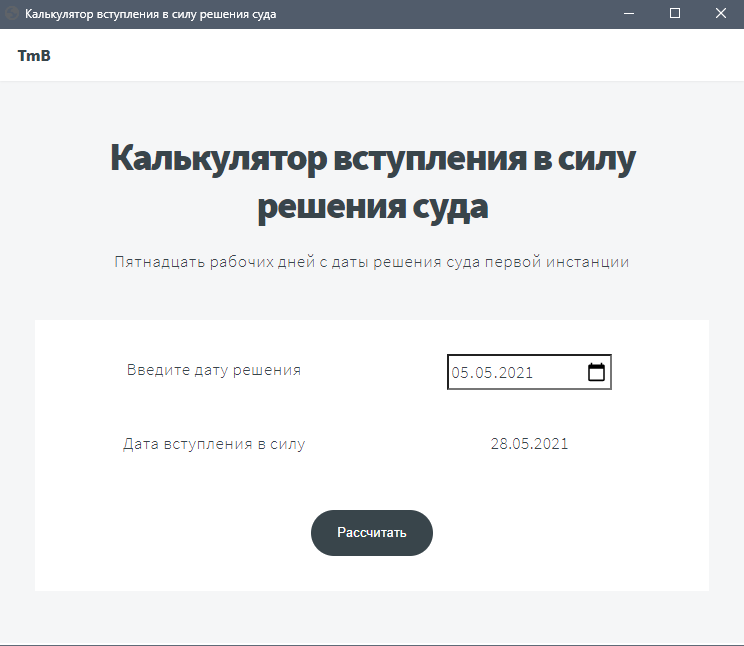

# Калькулятор вступления в силу решения суда
Актуально для судебных дел, рассматриваемых в порядке упрощенного производства 
АПК РФ, решения по которым вступают в силу по истечении пятнадцати рабочих
дней после даты вынесения, считая со следующего дня. 

## Логика работы калькулятора
Калькулятор ведет отсчет 15-ти рабочих дней, начиная со дня, 
следующего за днем вынесения решения суда (вводится пользователем). 
Из расчета исключаются выходные и праздничные дни, которые определяются 
путем парсинга производственного календаря с сайта 
["Консультант Плюс"](
http://www.consultant.ru/law/ref/calendar/proizvodstvennye/).
 
Учтена разница количества дней в високосных/невисокосных годах, а также 
ситуация, в которой решение, вынесенное в конце текущего года, вступит в 
силу в следующем.
В последнем случае производственный календарь запрашивается как для текущего 
года, так и для следующего. 

## Запуск
/decision_into_force/main.py

## Скриншоты
Графический интерфейс и пример работы калькулятора
 

